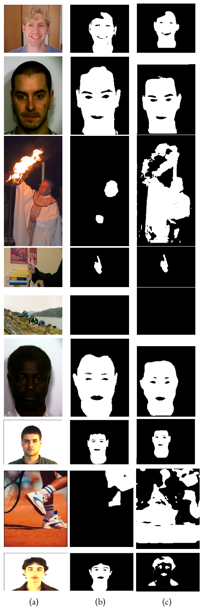
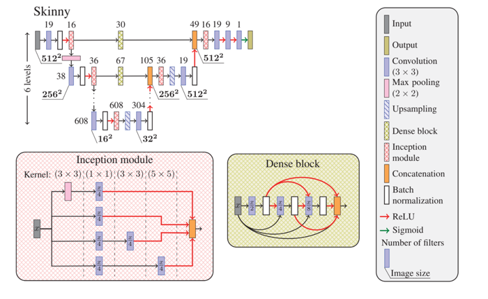

# Skinny

Detecting human skin using a U-Net.  

#### Original Paper
T. Tarasiewicz, J. Nalepa, and M. Kawulok. “Skinny: A Lightweight U-net for Skin Detection and Segmentation”. In: 2020 IEEE International Conference on Image Processing (ICIP). IEEE. 2020, pp. 2386–2390. https://doi.org/10.1109/ICIP40778.2020.9191209.

#### Credits
Credits to the authors of the original version: 
https://github.com/ttarasiewicz/Skinny

## Outcomes

> Significant outcomes: (a) the input image; (b) the ground truth; (c) Skinny's binarized prediction.  
Predictions have different dimensions than other images due to the network preprocessing.  
Input images are from ECU, HGR, and Schmugge datasets.
Various models have been used to detect skin pixels.

These are some significant outcomes (so not representative; for the skin detector performance see [Performance](#Performance))
that shows how well the skin detector performs given the right training dataset,
but also its limitations.  
Skin Detection is a challenging task because of materials with a skin-like colors (wood, copper, leather, clay),
conditions that modify an image appearance (lighting, camera color science, motion blur),
and the wide range of skin tones that the human skin may assume.  

The first, third, and the last three rows represent some of the challenges described.  
The U-Net has the capability of extracting features from images, hence it can detect that there are no skin pixels
in the fifth row, despite it can contain pixels with skin-like color. 

An in-depth analysis of outcomes can be seen in the thesis.

## Performance

Apart from the Validation process, which uses the original paper methodologies, the metrics are calculated as follows.  
Initially, the metrics are measured for all the instances, then the average and population standard
deviation for each metric are computed.

Again, an in-depth analysis of performance can be seen in the thesis.

#### Validation
Before the evaluation process on the chosen datasets, the skin detector has been validated on the datasets splits used in its original paper. In this way, it has been possible to check their proper functioning. The original paper calculates the F1-Score directly as the average score over all the set of instances.

|             | HGR1 F1-Score | ECU2 F1-Score |
| ---:            | :---:              | :---:  |
| Original        | 0.9494             | 0.9230 |
| Implementation  | 0.9308             | 0.9133 |
| | |
| Change          | 0.0186             | 0.0097 |
> 1HGR consists of: HGR1, HGR2A-downscaled, HGR2B-downscaled.  
2ECU was split accordingly to the original work of the method.  
The model was trained on the ECU splits; HGR has not been used for training.  
The testing was performed on the test set of ECU and the entirety of HGR.

#### Performance on single databases
For each dataset: the skin detector is trained on the training set, and then predictions are performed on the test set.  
For example, with ECU as the dataset, it means that the skin detector is trained using the training set of ECU, and then tested on the test set of ECU.

|             | ECU | HGR | Schmugge |
| ---:            | :---:              | :---:  | :---: |
| F1 ↑       | 0.9133 ± 0.08 | 0.9848 ± 0.02 | 0.6121 ± 0.45 |
| IoU ↑                 | 0.8489 ± 0.12 | 0.9705 ± 0.03 | 0.5850 ± 0.44 |
| Dprs ↓     | 0.1333 ± 0.12 | 0.0251 ± 0.03 | 0.5520 ± 0.64 |

#### Performance across databases
For each dataset: the skin detector is trained on the training set, and then predictions are performed on all the images of every other datasets.  
For example, with ECU as the training dataset and HGR as the testing dataset, it means
that the skin detector is trained using the training set of ECU, and then tested on all the HGR
dataset.  
The expression “HGR on ECU”
describes the situation in which the evaluation is performed by using HGR as the training set and ECU as the test set.

|             | ECU_on_HGR | ECU_on_Schmugge | HGR_on_ECU | HGR_on_Schmugge | Schmugge_on_ECU | Schmugge_on_HGR |
| ---: | :---: | :---: | :---: | :---: | :---: | :---: |
| F1 ↑       | 0.9308 ± 0.11 | 0.4625 ± 0.41 | 0.7252 ± 0.20 | 0.2918 ± 0.31 | 0.6133 ± 0.21 | 0.8106 ± 0.19 |
| IoU ↑                 | 0.8851 ± 0.15 | 0.3986 ± 0.37 | 0.6038 ± 0.22 | 0.2168 ± 0.25 | 0.4754 ± 0.22 | 0.7191 ± 0.23 |
| Dprs ↓     | 0.1098 ± 0.15 | 0.7570 ± 0.56 | 0.3913 ± 0.26 | 0.9695 ± 0.44 | 0.5537 ± 0.27 | 0.2846 ± 0.27 |
| F1 - IoU ↓ | 0.0457 | 0.0639 | 0.1214 | 0.0750 | 0.1379 | 0.0915 |

#### Performance on single skin tones
The methodology is the same as of 'Performance on single databases', but skin tones datasets are involved instead.

|             | DARK | MEDIUM | LIGHT
| ---:            | :---:              | :---:  | :---: |
| F1 ↑       | 0.9529 ± 0.00 | 0.9260 ± 0.15 | 0.9387 ± 0.12 |
| IoU ↑                 | 0.9100 ± 0.01 | 0.8883 ± 0.18 | 0.9006 ± 0.14 |
| Dprs ↓     | 0.0720 ± 0.01 | 0.1078 ± 0.21 | 0.0926 ± 0.15 |

#### Performance across skin tones
The methodology is the same as of 'Performance across databases', but skin tones datasets are involved instead.

|             | DARK_on_MEDIUM | DARK_on_LIGHT | MEDIUM_on_DARK | MEDIUM_on_LIGHT | LIGHT_on_DARK | LIGHT_on_MEDIUM |
| ---: | :---: | :---: | :---: | :---: | :---: | :---: |
| F1 ↑       | 0.7300 ± 0.25 | 0.7262 ± 0.26 | 0.8447 ± 0.13 | 0.8904 ± 0.14 | 0.7660 ± 0.17 | 0.9229 ± 0.11 |
| IoU ↑                 | 0.6279 ± 0.27 | 0.6276 ± 0.28 | 0.7486 ± 0.15 | 0.8214 ± 0.16 | 0.6496 ± 0.21 | 0.8705 ± 0.13 |
| Dprs ↓     | 0.3805 ± 0.33 | 0.3934 ± 0.34 | 0.2326 ± 0.17 | 0.1692 ± 0.18 | 0.3402 ± 0.21 | 0.1192 ± 0.16 |
| F1 - IoU ↓ | 0.1021 | 0.0986 | 0.0961 | 0.0690 | 0.1164 | 0.0524 |

## Network Architecture

> The architecture of Skinny. Adapted from the original paper (Tarasiewicz et al. 2020) 

The Skinny network consists of a modified U-Net incorporating dense
blocks and inception modules to benefit from a wider spatial context.  
An additional deep level is appended to the original U-Net model,
to better capture large-scale contextual features in the deepest
part of the network.  
The features extracted in the contracting path propagate to the
corresponding expansive levels through the dense blocks.  
The original U-Net convolutional layers are replaced with
the inception modules: before each max-pooling layer, in the contracting path,
and after concatenating features, in the expanding path.  
Thanks to these architectural choices, Skinny benefits from a wider pixel context.

## Public Datasets Supported

[ecu]: https://documents.uow.edu.au/~phung/download.html "ECU download page"
[hgr]: http://sun.aei.polsl.pl/~mkawulok/gestures/ "HGR download page"
[schmugge]: https://www.researchgate.net/publication/257620282_skin_image_Data_set_with_ground_truth "Schmugge download page"
[pratheepan]: http://cs-chan.com/downloads_skin_dataset.html "Pratheepan download page"
[abd]: https://github.com/MRE-Lab-UMD/abd-skin-segmentation "abd-skin download page"
[vpu]: http://www-vpu.eps.uam.es/publications/SkinDetDM/#dataset "VPU download page"
[uchile]: http://web.archive.org/web/20070707151628/http://agami.die.uchile.cl/skindiff/ "UChile download page"

| Name            |  Description                                               | Download |
| ---:            | :---:                                                      | :---: |
| ECU [1]         | 3998 pictures, mostly face and half-body shots             | [Download (ask the authors)][ecu] |
| HGR [2]         | 1558 hand gesture images                                   | [Download][hgr] |
| Schmugge [3]    | 845 images, mostly face shots                              | [Download][schmugge] |
| Pratheepan [4]  | 78 pictures randomly sampled from the web                  | [Download][pratheepan] |
| abd [5]         | 1400 abdominal pictures                                    | [Download][abd] |
| VPU [6]         | 285 human activity recognition images                      | [Download][vpu] |
| UChile [7]      | 101 images obtained from the web and digitized news videos | [Download][uchile] |

| Ref   | Publication |
| :---  | :--- |
| 1     | Phung, S., Bouzerdoum, A., & Chai, D. (2005). Skin segmentation using color pixel classification: analysis and comparison. IEEE Transactions on Pattern Analysis and Machine Intelligence, 27(1), 148-154. https://doi.org/10.1109/tpami.2005.17  |
| 2 | Kawulok, M., Kawulok, J., Nalepa, J., & Smolka, B. (2014). Self-adaptive algorithm for segmenting skin regions. EURASIP Journal on Advances in Signal Processing, 2014(1). https://doi.org/10.1186/1687-6180-2014-170 |
| 3 | Schmugge, S. J., Jayaram, S., Shin, M. C., & Tsap, L. V. (2007). Objective evaluation of approaches of skin detection using ROC analysis. Computer Vision and Image Understanding, 108(1-2), 41-51. https://doi.org/10.1016/j.cviu.2006.10.009 |
| 4 | Tan, W. R., Chan, C. S., Yogarajah, P., & Condell, J. (2012). A Fusion Approach for Efficient Human Skin Detection. IEEE Transactions on Industrial Informatics, 8(1), 138-147. https://doi.org/10.1109/tii.2011.2172451 |
| 5 | Topiwala, A., Al-Zogbi, L., Fleiter, T., & Krieger, A. (2019). Adaptation and Evaluation of Deep Learning Techniques for Skin Segmentation on Novel Abdominal Dataset. 2019 IEEE 19th International Conference on Bioinformatics and Bioengineering (BIBE). https://doi.org/10.1109/bibe.2019.00141 |
| 6 | SanMiguel, J. C., & Suja, S. (2013). Skin detection by dual maximization of detectors agreement for video monitoring. Pattern Recognition Letters, 34(16), 2102-2109. https://doi.org/10.1016/j.patrec.2013.07.016 |
| 7 | J. Ruiz-del-Solar and R. Verschae. “SKINDIFF-Robust and fast skin segmentation”. Department of Electrical Engineering, Universidad de Chile, 2006. |
